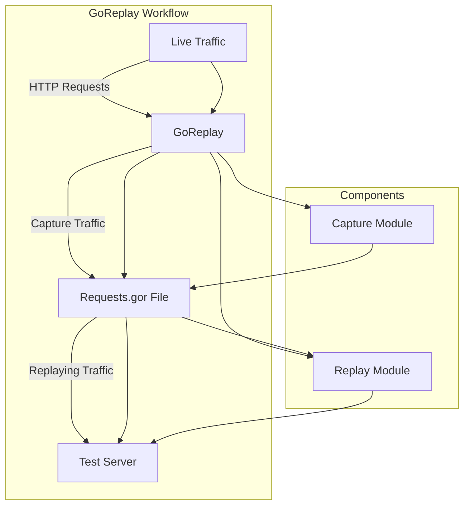

Goreplay (often written as "GoReplay" or "goreplay") is an open-source tool designed for capturing and replaying live HTTP traffic. It allows you to record your web traffic and then replay it in a controlled environment, which can be incredibly useful for testing, debugging, and performance evaluation.

### Why GoReplay is Useful

1. **Testing**:
   - **Load Testing**: Recreate production traffic to test the performance and scalability of your application under real-world conditions.
   - **Regression Testing**: Ensure that recent changes have not introduced new bugs by replaying previous traffic.
   - **A/B Testing**: Compare how different versions of your application handle the same traffic.

2. **Debugging**:
   - **Error Replication**: Replay traffic that caused errors in the production environment to understand and fix the issues in a test environment.
   - **Latency Analysis**: Analyze how different parts of your application respond to real traffic.

3. **Performance Tuning**:
   - **Bottleneck Identification**: Identify performance bottlenecks by analyzing how your application handles various loads.
   - **Infrastructure Optimization**: Test different configurations and setups to find the most efficient infrastructure for handling your traffic.

### How to Use GoReplay

#### Installation

GoReplay can be installed via various methods, including using pre-built binaries, Docker, or compiling from source. Here are some common installation methods:

1. **Using Pre-built Binaries**:
   - Download the appropriate binary for your operating system from the [GoReplay GitHub releases page](https://github.com/buger/goreplay/releases).
   - Extract the binary and move it to a directory in your system's PATH.

2. **Using Docker**:
   ```sh
   docker pull goreplay/goreplay
   ```

3. **Building from Source**:
   - Ensure you have Go installed.
   - Clone the repository and build the binary:
     ```sh
     git clone https://github.com/buger/goreplay.git
     cd goreplay
     make
     ```

#### Basic Usage

1. **Recording Traffic**:
   ```sh
   goreplay --input-raw :80 --output-file ./requests.gor
   ```
   This command captures HTTP traffic on port 80 and saves it to a file called `requests.gor`.

2. **Replaying Traffic**:
   ```sh
   goreplay --input-file ./requests.gor --output-http "http://your.test.server"
   ```
   This command replays the recorded traffic to the specified server.

3. **Mirroring Traffic**:
   ```sh
   goreplay --input-raw :80 --output-http "http://staging.server"
   ```
   This command captures live traffic on port 80 and mirrors it to a staging server.

#### Advanced Usage

- **Filtering Traffic**:
  You can filter traffic based on various criteria, such as headers, methods, or URLs.
  ```sh
  goreplay --input-raw :80 --output-http "http://staging.server" --http-allow-url ^/api
  ```
  This command only captures and replays traffic that matches the specified URL pattern.

- **Modifying Traffic**:
  Modify traffic during replay, such as changing headers or payloads.
  ```sh
  goreplay --input-file ./requests.gor --output-http "http://staging.server" --middleware "./modify_script.sh"
  ```

- **Throttling Traffic**:
  Control the rate at which traffic is replayed.
  ```sh
  goreplay --input-file ./requests.gor --output-http "http://staging.server" --output-http-workers 5
  ```

### basic workflow of GoReplay, including capturing, recording, and replaying traffic.



### Explanation:
1. **Live Traffic**: This represents the HTTP requests coming into your server.
2. **GoReplay**: The main tool that captures and replays the traffic.
3. **Requests.gor File**: A file where the captured traffic is recorded.
4. **Test Server**: The server where the traffic is replayed for testing.

### Components within GoReplay:
- **Capture Module**: This part of GoReplay is responsible for capturing the live HTTP traffic.
- **Replay Module**: This part of GoReplay replays the captured traffic to the test server.

This diagram visually explains how GoReplay works in a simplified manner. You can further expand it to include additional details like filtering, modifying traffic, or mirroring to multiple servers.
### Conclusion

GoReplay is a powerful tool for capturing, replaying, and analyzing HTTP traffic. It is particularly useful for testing, debugging, and optimizing web applications by allowing developers to replicate real-world traffic scenarios. By incorporating GoReplay into your development and testing workflows, you can improve the reliability and performance of your applications.